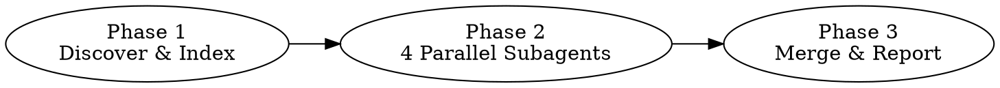

# Skill Governor Implementation Plan

> **For agentic workers:** REQUIRED SUB-SKILL: Use superpowers:subagent-driven-development (recommended) or superpowers:executing-plans to implement this plan task-by-task. Steps use checkbox (`- [ ]`) syntax for tracking.

**Goal:** Build a diagnostic skill that audits all installed Claude Code skills for duplicates, overlaps, conflicts, and stale entries.

**Architecture:** A pure-prompt skill (SKILL.md + references/analysis-prompts.md) that orchestrates a three-phase analysis: Phase 1 discovers and indexes all skills via Glob/Read; Phase 2 dispatches 4 parallel subagents for deep analysis; Phase 3 merges results and formats a terminal report.

**Tech Stack:** Claude Code skill (Markdown), no runtime dependencies

**Spec:** `docs/superpowers/specs/2026-03-26-skill-governor-design.md`

---

## File Structure

```
skills/skill-governor/
├── SKILL.md                       # Skill definition (frontmatter + complete orchestration instructions)
└── references/
    └── analysis-prompts.md        # Prompt templates for the 4 analysis subagents
```

**Responsibilities:**
- `SKILL.md`: Frontmatter triggers, Phase 1 discovery/index logic, Phase 2 subagent dispatch, Phase 3 report formatting, report templates
- `references/analysis-prompts.md`: Detailed prompt instructions for each of the 4 subagents (duplicate, overlap, conflict, stale detectors), including JSON output schema and Read budget constraints

---

### Task 1: Create SKILL.md with frontmatter and Phase 1 instructions

**Files:**
- Create: `skills/skill-governor/SKILL.md`

- [ ] **Step 1: Create skill directory**

```bash
mkdir -p skills/skill-governor/references
```

- [ ] **Step 2: Write SKILL.md frontmatter and overview**

Write to `skills/skill-governor/SKILL.md`:

```markdown
---
name: skill-governor
description: Use when auditing installed skills for quality issues — duplicates (same task, different name), overlaps (unclear boundaries, both trigger), conflicts (contradictory rules for same task), and stale entries (broken references, vague triggers, outdated descriptions). Use when asked to "audit skills", "check skill health", "find duplicate skills", "skill conflicts", or "skill quality".
---

# Skill Governor

Diagnostic audit of all installed Claude Code skills. Detects four problem types: duplicates, overlaps, conflicts, and stale entries. Read-only — reports findings but never modifies skill files.

## Three-Phase Analysis



## Phase 1: Discover & Index (you execute this directly)

### Step 1: Find all SKILL.md files

Use Glob to scan:
```
~/.claude/plugins/cache/**/SKILL.md
```

### Step 2: Validate and extract metadata

For each SKILL.md found, Read the first 10 lines. A valid skill file must:
- Start with YAML frontmatter (`---` on line 1)
- Contain a `name:` field
- Contain a `description:` field

Skip invalid files and record them for the "skipped" section of the report.

### Step 3: Version dedup

Group skill files by suite + plugin name. Path structures vary — three known patterns:

| Pattern | Example | Suite | Plugin |
|---------|---------|-------|--------|
| Standard | `cache/claude-plugins-official/superpowers/5.0.5/skills/X/SKILL.md` | `claude-plugins-official` | `superpowers` |
| .claude nested | `cache/ui-ux-pro-max-skill/ui-ux-pro-max/2.5.0/.claude/skills/X/SKILL.md` | `ui-ux-pro-max-skill` | `ui-ux-pro-max` |
| Flat | `cache/anthropic-agent-skills/document-skills/b0cbd3df1533/skills/X/SKILL.md` | `anthropic-agent-skills` | `document-skills` |

Extraction rule:
- **Suite**: first path segment after `cache/`
- **Plugin**: second path segment after suite

If multiple versions exist for the same suite + plugin:
- Semantic versions (e.g., `5.0.0`, `5.0.5`): keep the highest
- Git hashes (e.g., `b0cbd3df1533`): keep the one whose directory has the newest mtime (check with `ls -ltd`)
- Mixed: prefer semantic version over hash

### Step 4: Build the index table

For each valid, deduplicated skill, extract and format:
```
[N] name: <name> | suite: <suite> | path: <full-path>
    description: <description>
```

Concatenate all entries into a single index text block. Count total skills and suites.

### Step 5: Proceed to Phase 2

Pass the complete index table to Phase 2. Read `references/analysis-prompts.md` for the subagent prompt templates.
```

- [ ] **Step 3: Verify frontmatter is valid YAML**

```bash
head -3 skills/skill-governor/SKILL.md
```

Expected: `---`, `name: skill-governor`, `description: Use when...`

- [ ] **Step 4: Commit**

```bash
git add skills/skill-governor/SKILL.md
git commit -m "feat: add skill-governor SKILL.md with Phase 1 instructions"
```

---

### Task 2: Create analysis-prompts.md with 4 subagent prompt templates

**Files:**
- Create: `skills/skill-governor/references/analysis-prompts.md`

- [ ] **Step 1: Write the duplicate detection subagent prompt**

Write to `skills/skill-governor/references/analysis-prompts.md`:

````markdown
# Analysis Subagent Prompt Templates

These are the prompt templates for Phase 2's four parallel subagents. Each subagent receives the full skill index table from Phase 1 as context.

---

## Duplicate Detection Subagent

**Prompt template** (insert the index table where marked):

```
You are a skill duplicate detector. Analyze the following skill index and identify skills that solve the same core task.

## Skill Index
{INDEX_TABLE}

## Detection Rules

1. **Same-name cross-suite**: If two skills have the same `name` but different `suite`, flag immediately as duplicate.
2. **Semantic duplicate**: If two skills' descriptions indicate they would both trigger for >80% of the same user requests, flag as duplicate.

## Process

1. Scan the index for same-name entries across different suites.
2. For each potential semantic duplicate pair, Read both SKILL.md files in full to confirm.
3. Only flag pairs where the core task is genuinely the same — shared keywords alone are not enough.

## Budget

You may Read at most 15 SKILL.md files total.

## Output Format

Return ONLY valid JSON:

{
  "type": "duplicate",
  "findings": [
    {
      "id": "D-1",
      "severity": "critical",
      "skills": ["skill-a (suite-a)", "skill-b (suite-b)"],
      "reason": "Both skills create implementation plans from specs. make-plan uses claude-mem's memory system while writing-plans uses superpowers' brainstorming flow, but the core task is identical.",
      "recommendation": "Designate one as primary for plan creation; update the other's description to clarify its unique scope (e.g., memory-backed plans vs. spec-driven plans).",
      "details": {}
    }
  ]
}

If no duplicates found, return: {"type": "duplicate", "findings": []}
```
````

- [ ] **Step 2: Write the overlap detection subagent prompt**

Append to `skills/skill-governor/references/analysis-prompts.md`:

````markdown

---

## Overlap Detection Subagent

**Prompt template**:

```
You are a skill overlap detector. Analyze the following skill index and identify skills with partially overlapping trigger conditions.

## Skill Index
{INDEX_TABLE}

## Detection Rules

1. Two skills overlap when their descriptions suggest they would BOTH trigger for some user requests, but each also has unique scenarios the other does not cover.
2. Overlap is distinct from duplicate: overlapping skills have different core purposes but share edge-case scenarios.
3. If the overlapping scenarios exceed 50% of either skill's total trigger scenarios, escalate severity to "critical".

## Process

1. Identify skill pairs whose descriptions share trigger keywords or scenarios.
2. For each candidate pair, Read both SKILL.md files to understand their full scope.
3. List the specific overlapping scenarios and each skill's unique scenarios.
4. Assess overlap percentage and determine severity.

## Budget

You may Read at most 15 SKILL.md files total.

## Output Format

Return ONLY valid JSON:

{
  "type": "overlap",
  "findings": [
    {
      "id": "O-1",
      "severity": "warning",
      "skills": ["design-system (ui-ux-pro-max)", "brand-guidelines (anthropic-agent-skills)"],
      "reason": "Both trigger when creating brand color and typography specs. design-system focuses on code-level design tokens; brand-guidelines focuses on non-technical brand documents.",
      "recommendation": "Add explicit boundary in descriptions: design-system for code/tokens, brand-guidelines for marketing/print materials.",
      "details": {
        "overlap_scenarios": ["brand color definition", "typography specification", "spacing standards"],
        "boundary_suggestion": "design-system -> code-level design tokens and CSS variables; brand-guidelines -> PDF/document brand guides for non-technical stakeholders"
      }
    }
  ]
}

If no overlaps found, return: {"type": "overlap", "findings": []}
```
````

- [ ] **Step 3: Write the conflict detection subagent prompt**

Append to `skills/skill-governor/references/analysis-prompts.md`:

````markdown

---

## Conflict Detection Subagent

**Prompt template**:

```
You are a skill conflict detector. Analyze the following skill index and identify skills that give contradictory rules for the same type of task.

## Skill Index
{INDEX_TABLE}

## Detection Rules

Conflicts occur when two skills:
1. Both claim authority over the same task type, AND
2. Give OPPOSITE instructions for how to handle it (different directory conventions, different output formats, different tool usage strategies, different workflow orders)

A conflict is NOT just overlap — it's active contradiction. Skill A says "always do X" while Skill B says "never do X" for the same scenario.

## Process

1. Identify skill pairs that both claim to handle the same task type.
2. Read both SKILL.md files in full.
3. Compare their instructions line-by-line for contradictions in:
   - Workflow steps (different order, missing steps)
   - Tool usage (different tools for same purpose)
   - Output format (different schemas, different locations)
   - Directory conventions (different paths for same artifacts)
   - Rules and constraints (opposite restrictions)

## Budget

You may Read at most 15 SKILL.md files total.

## Output Format

Return ONLY valid JSON:

{
  "type": "conflict",
  "findings": [
    {
      "id": "C-1",
      "severity": "critical",
      "skills": ["make-plan (claude-mem)", "writing-plans (superpowers)"],
      "reason": "Both claim to be the entry point for creating implementation plans. make-plan outputs to a different directory and uses a different format than writing-plans. A user asking 'plan this feature' could trigger either with incompatible results.",
      "recommendation": "Establish priority: writing-plans for spec-driven plans in the superpowers workflow; make-plan for ad-hoc plans with memory integration. Update descriptions to be mutually exclusive.",
      "details": {
        "conflict_points": ["plan output directory", "plan format/template", "entry point claim"]
      }
    }
  ]
}

If no conflicts found, return: {"type": "conflict", "findings": []}
```
````

- [ ] **Step 4: Write the stale detection subagent prompt**

Append to `skills/skill-governor/references/analysis-prompts.md`:

````markdown

---

## Stale Detection Subagent

**Prompt template**:

```
You are a skill staleness detector. Analyze the following skill index and identify skills that are outdated, broken, or poorly defined.

## Skill Index
{INDEX_TABLE}

## Detection Rules

Check each skill for these issues:

### 1. Missing references (severity: warning)
The SKILL.md body references files in `references/`, `scripts/`, or `assets/` subdirectories that do not exist. Use Glob to verify: `<skill-directory>/references/*`, `<skill-directory>/scripts/*`, `<skill-directory>/assets/*`.

### 2. Overly broad description (severity: info)
The description uses vague language like "use for anything", "general purpose", "all tasks" without specific trigger conditions.

### 3. Missing trigger conditions (severity: info)
The description does NOT contain patterns like "Use when", "Use for", "Trigger when", or specific scenario keywords. A good description names exact situations; a bad one is generic.

### 4. Internal skill references broken (severity: warning)
The SKILL.md body references other skills (e.g., "use /foo", "invoke skill-name", "REQUIRED SUB-SKILL: superpowers:bar") that do not exist in the index.

## Process

1. For EVERY skill in the index (not just suspects), check rules 2 and 3 based on the description in the index.
2. For skills flagged by rules 2 or 3, Read the full SKILL.md to confirm and check rules 1 and 4.
3. For rule 1, use Glob to check if referenced subdirectories and files exist.

## Budget

You may Read at most 20 SKILL.md files and run at most 20 Glob commands.

## Output Format

Return ONLY valid JSON:

{
  "type": "stale",
  "findings": [
    {
      "id": "S-1",
      "severity": "info",
      "skills": ["algorithmic-art (anthropic-agent-skills)"],
      "reason": "Description is 'generative/computational art' — no specific trigger conditions, no 'Use when' clause, extremely broad scope with rare actual use cases.",
      "recommendation": "Narrow description to specific triggers: 'Use when creating generative art with p5.js, Processing, or computational geometry algorithms.'",
      "details": {
        "missing_references": [],
        "conflict_points": []
      }
    }
  ]
}

If no stale skills found, return: {"type": "stale", "findings": []}
```
````

- [ ] **Step 5: Commit**

```bash
git add skills/skill-governor/references/analysis-prompts.md
git commit -m "feat: add analysis prompt templates for 4 subagents"
```

---

### Task 3: Complete SKILL.md with Phase 2 and Phase 3 instructions

**Files:**
- Modify: `skills/skill-governor/SKILL.md` (append after Phase 1)

- [ ] **Step 1: Add Phase 2 subagent dispatch instructions**

Append to `skills/skill-governor/SKILL.md`:

````markdown

## Phase 2: Deep Analysis (dispatch 4 parallel subagents)

Read `references/analysis-prompts.md` to get the prompt templates for each subagent.

Dispatch ALL FOUR subagents in a SINGLE message using the Agent tool (this runs them in parallel):

1. **Duplicate Detection Agent** — use the "Duplicate Detection Subagent" prompt template
2. **Overlap Detection Agent** — use the "Overlap Detection Subagent" prompt template
3. **Conflict Detection Agent** — use the "Conflict Detection Subagent" prompt template
4. **Stale Detection Agent** — use the "Stale Detection Subagent" prompt template

For each subagent:
- Replace `{INDEX_TABLE}` in the prompt with the actual index table from Phase 1
- Set `subagent_type` to `general-purpose`
- The subagent will return a JSON result

Wait for all 4 subagents to complete before proceeding to Phase 3.
````

- [ ] **Step 2: Add Phase 3 merge and sort logic**

Append to `skills/skill-governor/SKILL.md`:

````markdown

## Phase 3: Merge Results & Generate Report

### Step 1: Parse subagent results

Extract the JSON from each subagent's response. Each should match this schema:

```json
{
  "type": "duplicate|overlap|conflict|stale",
  "findings": [
    {
      "id": "X-N",
      "severity": "critical|warning|info",
      "skills": ["skill-a (suite-a)", "skill-b (suite-b)"],
      "reason": "...",
      "recommendation": "...",
      "details": {}
    }
  ]
}
```

### Step 2: Merge and deduplicate

If two subagents flagged the same skill pair (e.g., overlap detector and conflict detector both flagged skill-a vs skill-b), keep the finding with the higher severity.

### Step 3: Sort by severity

Order: critical first, then warning, then info.
````

- [ ] **Step 3: Add Phase 3 report template**

Append to `skills/skill-governor/SKILL.md`:

````markdown

### Step 4: Format and output the report

Use this exact template:

```
============================================================
                  Skill Governor 审计报告
============================================================
 扫描范围: ~/.claude/plugins/cache/
 Skill 总数: {TOTAL} (去重后)  |  来自 {SUITES} 个插件套件
 已跳过: {SKIPPED} 个无效文件
 发现问题: {ISSUES} 个  |  严重 {CRITICAL}  警告 {WARNING}  建议 {INFO}
============================================================

-- [严重] 重复 (DUPLICATE) ---------------------------------

{For each duplicate finding:}
[{id}] {skill-a} vs {skill-b}
  套件: {suite-a} vs {suite-b}
  原因: {reason}
  建议: {recommendation}

-- [警告] 重叠 (OVERLAP) -----------------------------------

{For each overlap finding:}
[{id}] {skill-a} vs {skill-b}
  重叠场景: {details.overlap_scenarios joined by ", "}
  边界建议: {details.boundary_suggestion}

-- [严重] 冲突 (CONFLICT) ----------------------------------

{For each conflict finding:}
[{id}] {skill-a} vs {skill-b}
  冲突点: {reason}
  建议: {recommendation}

-- [建议] 失效 (STALE) -------------------------------------

{For each stale finding:}
[{id}] {skills[0]}
  原因: {reason}
  建议: {recommendation}

============================================================
                      推荐操作摘要
============================================================
{Numbered list of all findings sorted by severity, one line each:}
1. [严重] {recommendation}
2. [警告] {recommendation}
3. [建议] {recommendation}

{If any files were skipped:}
已跳过的文件:
{For each skipped file:}
- {path} ({skip reason})
```

### Zero-issues report

If all 4 subagents return empty findings, output:

```
============================================================
                  Skill Governor 审计报告
============================================================
 扫描范围: ~/.claude/plugins/cache/
 Skill 总数: {TOTAL} (去重后)  |  来自 {SUITES} 个插件套件
 发现问题: 0 个

 所有 skill 通过审计，未发现重复、重叠、冲突或失效问题。
============================================================
```

### Omit empty sections

If a category has zero findings (e.g., no duplicates found), omit that entire section from the report. Only show sections that have findings.
````

- [ ] **Step 4: Verify SKILL.md is complete**

Read the full file and verify it contains:
- Valid frontmatter with name and description
- Phase 1: 5 steps (discover, validate, dedup, index, handoff)
- Phase 2: 4 subagent dispatch
- Phase 3: 4 steps (parse, merge, sort, format) + report templates

```bash
wc -l skills/skill-governor/SKILL.md
```

Expected: ~150-200 lines

- [ ] **Step 5: Commit**

```bash
git add skills/skill-governor/SKILL.md
git commit -m "feat: complete SKILL.md with Phase 2 dispatch and Phase 3 report formatting"
```

---

### Task 4: End-to-end test — run skill-governor against real skills

**Files:**
- None (testing only)

- [ ] **Step 1: Verify skill files exist and are well-formed**

```bash
head -5 skills/skill-governor/SKILL.md
ls skills/skill-governor/references/
```

Expected: frontmatter visible, `analysis-prompts.md` listed

- [ ] **Step 2: Simulate Phase 1 — discover skills**

Run Glob for `~/.claude/plugins/cache/**/SKILL.md` and count results. Verify the scan finds 40+ files.

- [ ] **Step 3: Spot-check version dedup logic**

Check that the cache has multiple versions for at least one plugin:

```bash
ls -d ~/.claude/plugins/cache/claude-plugins-official/superpowers/*/
```

Expected: at least two version directories (e.g., `5.0.0/` and `5.0.5/`)

- [ ] **Step 4: Spot-check known issues**

Verify that known problem pairs exist in the skill index:
- `skill-creator` in both `anthropic-agent-skills` and `claude-plugins-official`
- `frontend-design` in both suites
- `make-plan` (claude-mem) vs `writing-plans` (superpowers)

These should be caught by the duplicate/conflict detectors.

- [ ] **Step 5: Document test results**

Record which skills were found, any issues with the scan, and whether the known problem pairs are present. This validates Phase 1 readiness.

- [ ] **Step 6: Commit any fixes**

If any issues were found in Steps 2-5, fix them and commit:

```bash
git add skills/skill-governor/
git commit -m "fix: address issues found in end-to-end testing"
```

If no fixes needed, skip this step.

---

### Task 5: Install and run the skill

**Files:**
- None (deployment and live testing)

- [ ] **Step 1: Document installation method**

The skill needs to be accessible as `/skill-governor`. Verify how custom skills are installed by checking the `.claude/settings.json` plugin configuration pattern.

- [ ] **Step 2: Run the skill**

Invoke `/skill-governor` and observe:
- Phase 1 runs and produces an index table
- Phase 2 dispatches 4 subagents
- Phase 3 produces a formatted report

- [ ] **Step 3: Validate report quality**

Check that the report:
- Has correct total skill count
- Has correct suite count
- Identifies at least 1 known duplicate (e.g., `skill-creator` cross-suite)
- Identifies at least 1 known overlap or conflict
- Uses the correct severity levels
- Has a recommendation summary section

- [ ] **Step 4: Fix any issues and re-test**

If the report has issues, fix the SKILL.md or analysis-prompts.md and re-run.

- [ ] **Step 5: Final commit**

```bash
git add skills/skill-governor/
git commit -m "feat: skill-governor v1.0 — tested and validated"
```
