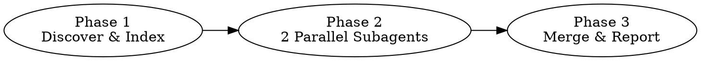

# Skill Governor

Diagnostic audit of all installed Claude Code skills. Detects four problem types: duplicates, overlaps, conflicts, and stale entries. Read-only — reports findings but never modifies skill files.

## Three-Phase Analysis



## Phase 1: Discover & Index (you execute this directly)

### Step 1: Run the scan script

~~~bash
# Find the installed script (version-agnostic):
SCAN=$(ls ~/.claude/plugins/cache/my-skills-pocket/skill-governor/*/scripts/scan.py 2>/dev/null | sort -V | tail -1)
python3 "$SCAN"
~~~

Or from the project source:
~~~bash
python3 <path-to-skill-governor-plugin>/scripts/scan.py
~~~

The script outputs a JSON object with:
- `skills`: all installed skills with name, description, suite, plugin, path, body_preview (first 50 lines after frontmatter)
- `commands`, `agents`, `hooks`, `mcps`: other installed components
- `findings`: mechanical issues already detected (same-name cross-suite duplicates, missing reference files)

### Step 2: Parse the JSON output

Read the script output. The `findings` array already contains confirmed issues — include them directly in the final report without re-analysis.

### Step 3: Build the semantic index

From the `skills` array, format the index table for Phase 2 subagents:

```
[N] name: <name> | suite: <suite> | plugin: <plugin>
    description: <description>
    preview: <first 3 lines of body_preview>
```

Count total skills and suites.

### Step 4: Proceed to Phase 2

## Phase 2: Semantic Analysis (dispatch 2 parallel subagents)

Read `references/analysis-prompts.md` for the prompt templates.

Dispatch BOTH subagents in a SINGLE message using the Agent tool (runs in parallel):

1. **Duplicate + Conflict Agent** — use the "Duplicate & Conflict Detection Subagent" prompt template
2. **Overlap Detection Agent** — use the "Overlap Detection Subagent" prompt template

For each subagent:
- Replace `{INDEX_TABLE}` with the semantic index from Phase 1
- Set `subagent_type` to `general-purpose`

Wait for both subagents to complete before proceeding to Phase 3.

## Phase 3: Merge Results & Generate Report

### Step 1: Parse and merge all findings

Combine findings from three sources:
1. `findings` array from scan.py output (mechanical issues — already confirmed, no re-analysis needed)
2. Duplicate + Conflict subagent JSON result
3. Overlap subagent JSON result

Dedup: if the same skill pair appears in both semantic subagents, keep the higher severity finding.

### Step 2: Merge and deduplicate

If two subagents flagged the same skill pair, keep the finding with the higher severity.

### Step 3: Sort by severity

Order: critical first, then warning, then info.

### Step 4: Format and output the report

**CRITICAL:** Copy ALL Chinese characters in this template VERBATIM. Do NOT retype or regenerate any Chinese text — transcription errors cause garbled output.

Output the report by filling in only the `{PLACEHOLDER}` values below. Repeat finding blocks for each finding. Omit sections with zero findings. Omit the skipped-files block if SKIPPED is 0.

```
============================================================
                  Skill Governor 审计报告
============================================================
 扫描范围: ~/.claude/plugins/cache/
 Skill 总数: {TOTAL} (去重后)  |  来自 {SUITES} 个插件套件
 已跳过: {SKIPPED} 个无效文件
 发现问题: {ISSUES} 个  |  严重 {CRITICAL}  警告 {WARNING}  建议 {INFO}
============================================================

-- [严重] 重复 (DUPLICATE) ---------------------------------

[{id}] {skill-a} vs {skill-b}
  套件: {suite-a} vs {suite-b}
  原因: {reason}
  建议: {recommendation}

-- [警告] 重叠 (OVERLAP) -----------------------------------

[{id}] {skill-a} vs {skill-b}
  重叠场景: {overlap_scenarios}
  边界建议: {boundary_suggestion}

-- [严重] 冲突 (CONFLICT) ----------------------------------

[{id}] {skill-a} vs {skill-b}
  冲突点: {reason}
  建议: {recommendation}

-- [建议] 失效 (STALE) -------------------------------------

[{id}] {skill-name} ({suite})
  原因: {reason}
  建议: {recommendation}

============================================================
                      推荐操作摘要
============================================================
1. [严重] {recommendation}
2. [警告] {recommendation}
3. [建议] {recommendation}

已跳过的文件:
- {path} ({skip_reason})
```

### Zero-issues report

If all 4 subagents return empty findings, output:

```
============================================================
                  Skill Governor 审计报告
============================================================
 扫描范围: ~/.claude/plugins/cache/
 Skill 总数: {TOTAL} (去重后)  |  来自 {SUITES} 个插件套件
 发现问题: 0 个

 所有 skill 通过审计，未发现重复、重叠、冲突或失效问题。
============================================================
```

### Omit empty sections

If a category has zero findings (e.g., no duplicates found), omit that entire section from the report. Only show sections that have findings.
