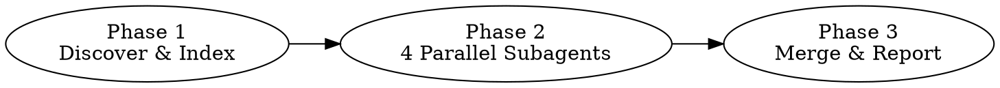

# Skill Governor

Diagnostic audit of all installed Claude Code skills. Detects four problem types: duplicates, overlaps, conflicts, and stale entries. Read-only — reports findings but never modifies skill files.

## Three-Phase Analysis



## Phase 1: Discover & Index (you execute this directly)

### Step 1: Find all SKILL.md files

Glob may truncate results for large directories. Scan per-suite to ensure complete coverage:

```bash
# Run one Glob per top-level suite directory to avoid truncation:
~/.claude/plugins/cache/claude-plugins-official/**/SKILL.md
~/.claude/plugins/cache/anthropic-agent-skills/**/SKILL.md
~/.claude/plugins/cache/thedotmack/**/SKILL.md
~/.claude/plugins/cache/ui-ux-pro-max-skill/**/SKILL.md
```

If any of the above patterns return zero results, also run a catch-all:
```
~/.claude/plugins/cache/**/SKILL.md
```

Merge all results and deduplicate by full path.

### Step 2: Validate and extract metadata

For each SKILL.md found, Read the first 10 lines. A valid skill file must:
- Start with YAML frontmatter (`---` on line 1)
- Contain a `name:` field
- Contain a `description:` field

Skip invalid files and record them for the "skipped" section of the report.

### Step 3: Version dedup

Group skill files by suite + plugin name. Path structures vary — three known patterns:

| Pattern | Example | Suite | Plugin |
|---------|---------|-------|--------|
| Standard | `cache/claude-plugins-official/superpowers/5.0.5/skills/X/SKILL.md` | `claude-plugins-official` | `superpowers` |
| .claude nested | `cache/ui-ux-pro-max-skill/ui-ux-pro-max/2.5.0/.claude/skills/X/SKILL.md` | `ui-ux-pro-max-skill` | `ui-ux-pro-max` |
| Flat | `cache/anthropic-agent-skills/document-skills/b0cbd3df1533/skills/X/SKILL.md` | `anthropic-agent-skills` | `document-skills` |

Extraction rule:
- **Suite**: first path segment after `cache/`
- **Plugin**: second path segment after suite

If multiple versions exist for the same suite + plugin:
- Semantic versions (e.g., `5.0.0`, `5.0.5`): keep the highest
- Git hashes (e.g., `b0cbd3df1533`): keep the one whose directory has the newest mtime (check with `ls -ltd`)
- Mixed: prefer semantic version over hash

### Step 4: Build the index table

For each valid, deduplicated skill, extract and format:
```
[N] name: <name> | suite: <suite> | path: <full-path>
    description: <description>
```

Concatenate all entries into a single index text block. Count total skills and suites.

### Step 5: Proceed to Phase 2

Pass the complete index table to Phase 2. Read `references/analysis-prompts.md` for the subagent prompt templates.

## Phase 2: Deep Analysis (dispatch 4 parallel subagents)

Read `references/analysis-prompts.md` to get the prompt templates for each subagent.

Dispatch ALL FOUR subagents in a SINGLE message using the Agent tool (this runs them in parallel):

1. **Duplicate Detection Agent** — use the "Duplicate Detection Subagent" prompt template
2. **Overlap Detection Agent** — use the "Overlap Detection Subagent" prompt template
3. **Conflict Detection Agent** — use the "Conflict Detection Subagent" prompt template
4. **Stale Detection Agent** — use the "Stale Detection Subagent" prompt template

For each subagent:
- Replace `{INDEX_TABLE}` in the prompt with the actual index table from Phase 1
- Set `subagent_type` to `general-purpose`
- The subagent will return a JSON result

Wait for all 4 subagents to complete before proceeding to Phase 3.

## Phase 3: Merge Results & Generate Report

### Step 1: Parse subagent results

Extract the JSON from each subagent's response. Each should match this schema:

```json
{
  "type": "duplicate|overlap|conflict|stale",
  "findings": [
    {
      "id": "X-N",
      "severity": "critical|warning|info",
      "skills": ["skill-a (suite-a)", "skill-b (suite-b)"],
      "reason": "...",
      "recommendation": "...",
      "details": {}
    }
  ]
}
```

### Step 2: Merge and deduplicate

If two subagents flagged the same skill pair (e.g., overlap detector and conflict detector both flagged skill-a vs skill-b), keep the finding with the higher severity.

### Step 3: Sort by severity

Order: critical first, then warning, then info.

### Step 4: Format and output the report

**CRITICAL:** Copy ALL Chinese characters in this template VERBATIM. Do NOT retype or regenerate any Chinese text — transcription errors cause garbled output.

Output the report by filling in only the `{PLACEHOLDER}` values below. Repeat finding blocks for each finding. Omit sections with zero findings. Omit the skipped-files block if SKIPPED is 0.

```
============================================================
                  Skill Governor 审计报告
============================================================
 扫描范围: ~/.claude/plugins/cache/
 Skill 总数: {TOTAL} (去重后)  |  来自 {SUITES} 个插件套件
 已跳过: {SKIPPED} 个无效文件
 发现问题: {ISSUES} 个  |  严重 {CRITICAL}  警告 {WARNING}  建议 {INFO}
============================================================

-- [严重] 重复 (DUPLICATE) ---------------------------------

[{id}] {skill-a} vs {skill-b}
  套件: {suite-a} vs {suite-b}
  原因: {reason}
  建议: {recommendation}

-- [警告] 重叠 (OVERLAP) -----------------------------------

[{id}] {skill-a} vs {skill-b}
  重叠场景: {overlap_scenarios}
  边界建议: {boundary_suggestion}

-- [严重] 冲突 (CONFLICT) ----------------------------------

[{id}] {skill-a} vs {skill-b}
  冲突点: {reason}
  建议: {recommendation}

-- [建议] 失效 (STALE) -------------------------------------

[{id}] {skill-name} ({suite})
  原因: {reason}
  建议: {recommendation}

============================================================
                      推荐操作摘要
============================================================
1. [严重] {recommendation}
2. [警告] {recommendation}
3. [建议] {recommendation}

已跳过的文件:
- {path} ({skip_reason})
```

### Zero-issues report

If all 4 subagents return empty findings, output:

```
============================================================
                  Skill Governor 审计报告
============================================================
 扫描范围: ~/.claude/plugins/cache/
 Skill 总数: {TOTAL} (去重后)  |  来自 {SUITES} 个插件套件
 发现问题: 0 个

 所有 skill 通过审计，未发现重复、重叠、冲突或失效问题。
============================================================
```

### Omit empty sections

If a category has zero findings (e.g., no duplicates found), omit that entire section from the report. Only show sections that have findings.
